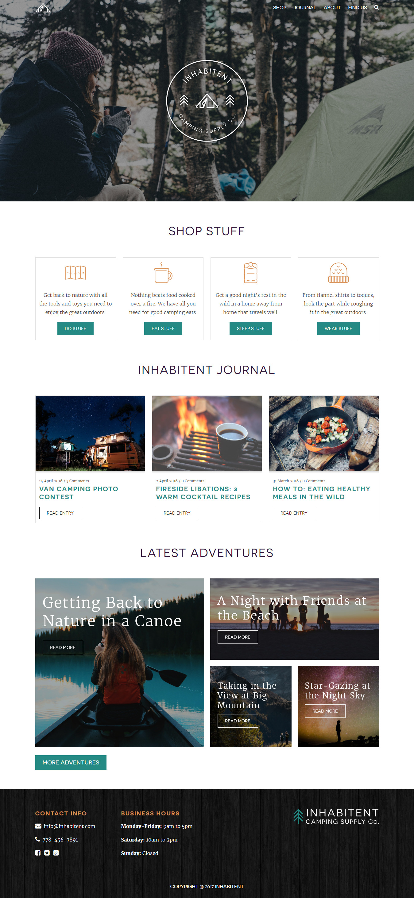

# Project 4 (Inhabitent)
##Description

The creation of a Wordpress Template for a site called "Inhabitent"

## Technologies used: 

Gulp
jQuery
SASS
PHP
HTML
Wordpress

## Learnings:

With this project, I was able to understand the Custom Post Types creation and Custom Taxonomies, which will help us to organize in a more efficient way our Wordpress "Back-end". Aslo, I could learn more about Php and how to combine HTML and PHP in one same file.

Albert J Robles

## Contact Information

E-mail: jalberto.robles@outlook.com

## License

This is my fourth project on RED Academy, not much to see here. Creative Commons License. 2018